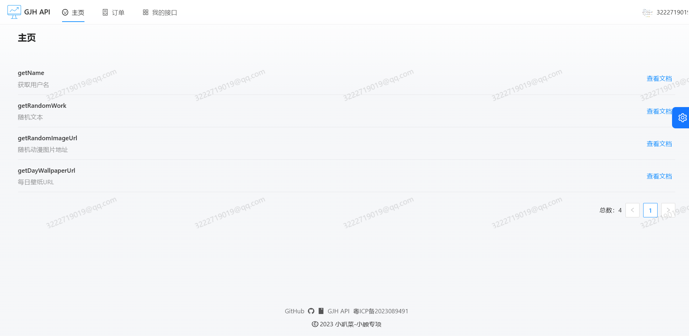
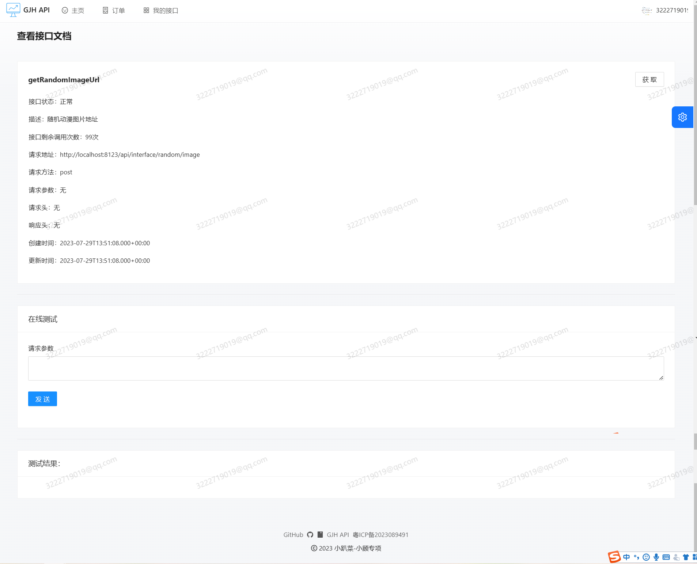
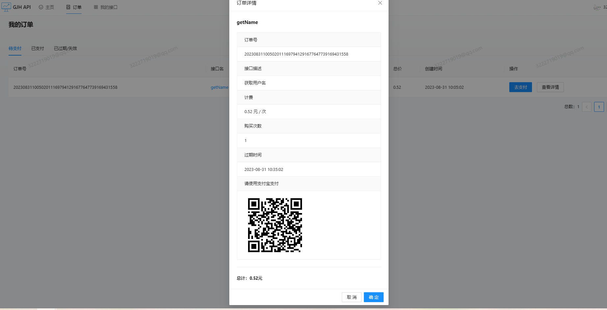
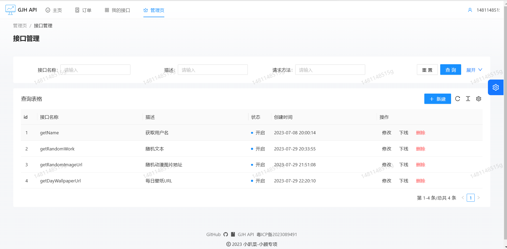
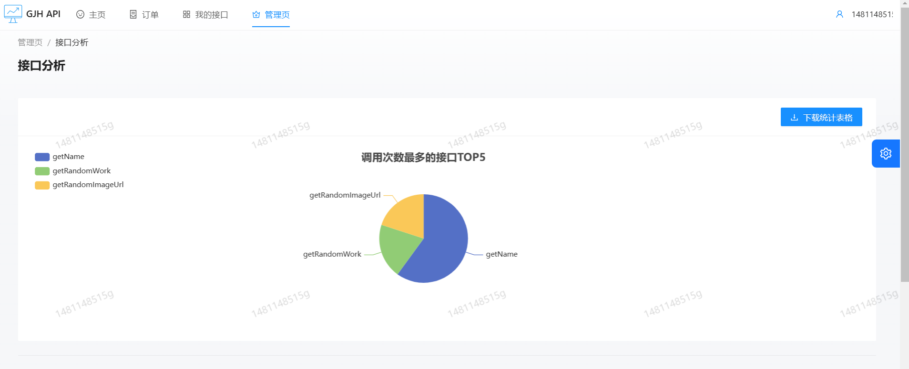
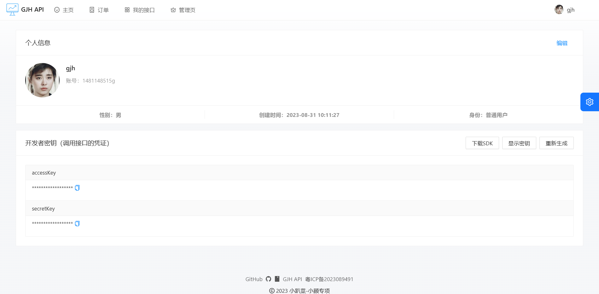

# GJH API

> 一个丰富的API开放调用平台，为开发者提供便捷、实用、安全的API调用体验
>
>  Java + React 全栈项目，包括网站前台+后台
>
> 后端开源地址：[[g1481148515/GJH-API (github.com)]([g1481148515/GJH-API (github.com)](https://github.com/g1481148515/GJH-API))]


## 项目展示


- 首页



- 接口详情

  

  

- 购买接口


- 接口支付



- 接口管理



- 接口分析



- 用户管理


- 个人中心




## 项目背景

&emsp;&emsp;我的初衷是为了最大程度地帮助和服务更多的用户和开发者，使他们能够轻松获取所需信息和功能，提高使用的便捷性和效率。

​		通过接口平台，开发者能够快速接入各种常用服务，从而加速开发过程。例如，随机头像、随机壁纸以及专为二次元爱好者准备的随机动漫图片等服务，这些在许多应用和小程序中常见的功能，可以通过我们的接口平台更加便捷地实现。

​		这些接口不仅为开发者提供了便利，也让用户在使用应用时享受到更全面的功能和服务，进而提升整体用户体验。我们的目标是不断完善这个平台，以满足用户和开发者不断增长的需求，为大家创造一个更加无缝和愉悦的数字环境。


## 系统架构


## 技术栈

### 前端技术栈

- 开发框架：React、Umi
- 脚手架：Ant Design Pro
- 组件库：Ant Design、Ant Design Components
- 语法扩展：TypeScript、Less
- 打包工具：Webpack
- 代码规范：ESLint、StyleLint、Prettier


### 后端技术栈

- 主语言：Java
- 框架：SpringBoot 2.7.0、Mybatis-plus、Spring Cloud
- 数据库：Mysql8.0、Redis
- 中间件：RabbitMq
- 注册中心：Nacos
- 服务调用：Dubbo
- 网关：Spring Cloud Gateway
- 负载均衡：Spring cloud Loadbalancer


## 项目模块

- api-frontend ：为项目前端，前端项目启动具体看readme.md文档
- api-common ：为公共封装类（如公共实体、公共常量，统一响应实体，统一异常处理）
- api-backend ：为接口管理平台，主要包括用户、接口相关的功能
- api-gateway ：为网关服务，**涉及到网关限流，统一鉴权，统一日志处理，接口统计，接口数据一致性处理**
- api-order ：为订单服务，主要涉及到接口的购买等
- api-third-party：为第三方服务，主要涉及到腾讯云短信、支付宝沙箱支付功能
- api-interface：为接口服务，提供可供调用的接口
- api-sdk：提供给开发者的SDK


## 功能模块

> 🌟 亮点功能 🚀 未来计划

- 用户、管理员
  - 🌟登录注册：使用令牌桶算法实现手机短信(邮箱)接口的限流，保护下游服务
  - 🌟个人主页，包括上传头像，显示密钥，重新生成ak/sk
  - 管理员：用户管理
  - 管理员：接口管理
  - 管理员：接口分析、订单分析
- 接口
  - 浏览接口信息
  - 🌟 数字签名校验接口调用权限
  - 🌟 SDK调用接口
  - 接口搜索 (🚀 )
  - 购买接口
  - 下载SDK
  - 用户上传自己的接口（🚀）
- 订单
  - 创建订单
  - 🌟订单超时回滚
  - 🌟支付宝沙箱支付


## 快速上手

### 后端

1. 将各模块配置修改成你自己本地/服务器的端口、账号、密码
2. 启动Nacos、Mysql、Redis、RabbitMq
3. 将公共服务 api-common 以及客户端 SDK 安装到本地仓库
4. 按顺序启动服务

服务启动顺序参考：
1. api-backend
2. api-order
3. api-gateway
4. api-third-party
5. api-interface

### 前端

环境要求：Node.js >= 16

安装依赖：

```
yarn
```

启动：

```
npm run start:dev
```
**注意：如果想要体验订单和支付业务并且没有个人云服务器的，需要配置内网穿透才能体验(非必要)**


## 欢迎贡献

项目需要大家的支持，期待更多小伙伴的贡献，你可以：

- 对于项目中的Bug和建议，能够在Issues区提出建议，我会积极响应


